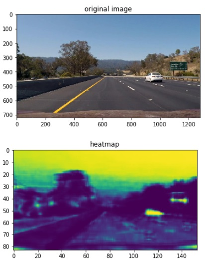
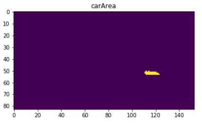
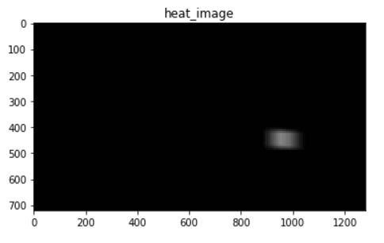
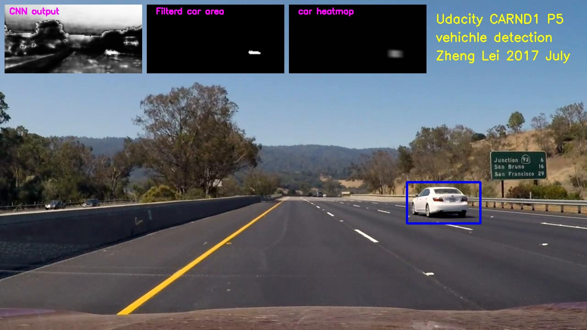

## Udacity carnd term1
## Project5 Vehicle Detection and Tracking 

###Zheng lei

###Goals:

To write a software pipeline to identify vehicles in a video from a front-facing camera on a car.

The dataset can be found in udacity's repo:
https://github.com/udacity/CarND-Vehicle-Detection

### Main ideas:
1) I use Keras build an neural network model to detect the vehicle.   
2) Using the trained model to convert the image to heatmap.   
3) Definr threshold in heatmap, find interesting area.  
4) Calculate the position of the car, I build a function named"search_active_region".  
5) Draw rectangle in image.  


## Step0 Read in data, train the classifier

#### Readin dataset,  generate X vector and Y vector.
```python
import glob 
import cv2
import numpy as np
import skimage
from skimage import data, color, exposure

#The images provided (car and non car) shoulb be placed in ./vehicles/ and ./non-vehicles/
cars = glob.glob("./vehicles/*/*.png")
non_cars = glob.glob("./non-vehicles/*/*.png")

# Generate Y Vector
Y = np.concatenate([np.ones(len(cars)), np.zeros(len(non_cars))-1])

# Read X Vector
X = []
for name in cars:    
    X.append(skimage.io.imread(name))
for name in non_cars:    
    X.append(skimage.io.imread(name))
X = np.array(X)
```

#### After loading I devide the data to test set and validation set
```python
from sklearn.model_selection import train_test_split
X_train, X_test, Y_train, Y_test = train_test_split(X, Y, test_size=0.10, random_state=42)

X_train = X_train.astype('float32')
X_test = X_test.astype('float32')
print('X_train shape:', X_train.shape)
print(X_train.shape[0], 'train samples')
print(X_test.shape[0], 'test samples')
input_shape =  (3,64,64)
```

#### Feature extraxtion and Define Keras model 

Because I am more familiar with neural network than other models, I select Keras to build an neural network classifier.

This is my network structure.

|Layer (type)           | Output Shape      |Param #    |  
| ----------------------|:------------------|----------:|
| lambda_7 (Lambda)     |(None, 64, 64, 3)  |0          |
| conv1 (Conv2D)        |(None, 64, 64, 10) |280        |
| dropout_16 (Dropout)  |(None, 64, 64, 10) |0          |
| conv2 (Conv2D)        |(None, 64, 64, 10) |910        |
| max_pooling2d         |(None, 8, 8, 10)   |0          |
| dropout_17            |(None, 8, 8, 10)   |0          |
| dense1 (Conv2D)       |(None, 1, 1, 128)  |82048      |
| dropout_18 (Dropout)  |(None, 1, 1, 128)  |0          |
| dense2 (Conv2D)       |(None, 1, 1, 1)    |129        |
| flatten_3 (Flatten)   |(None, 1)          |0          |

=================================================================
Total params: 83,367
Trainable params: 83,367
Non-trainable params: 0

In the model definition I do not use any dense layers, but analogous Convolution2D layers. After 20 epoch, the traning accuracy is 0.97 and validation accuracy is 0.953.

```python
from keras.models import Sequential
from keras.layers import Dense, Dropout, Activation, Flatten,Lambda
from keras.layers import Convolution2D, MaxPooling2D,Conv2D
from keras.utils import np_utils
from keras import backend as K

def get_conv(input_shape=(64,64,3), filename=None):
    model = Sequential()
    model.add(Lambda(lambda x: x/127.5 - 1.,input_shape=input_shape, output_shape=input_shape))
    
    #conv1
    model.add(Convolution2D(10, 3, 3, activation='relu', name='conv1',input_shape=input_shape, border_mode="same"))
    model.add(Dropout(0.25))
    
    #conv2
    model.add(Convolution2D(10, 3, 3, activation='relu', name='conv2',border_mode="same"))
    model.add(MaxPooling2D(pool_size=(8,8)))
    model.add(Dropout(0.25))
    
    #dense 1
    model.add(Convolution2D(128,8,8,activation="relu",name="dense1")) 
    model.add(Dropout(0.5))
    
    #dense 2
    model.add(Convolution2D(1,1,1,name="dense2", activation="tanh"))
    if filename:
        model.load_weights(filename)        
    return model

model = get_conv()
model.add(Flatten())
model.compile(loss='mse',optimizer='adadelta',metrics=['accuracy'])

model.fit(X_train, Y_train, batch_size=128, nb_epoch=20, verbose=1, validation_data=(X_test, Y_test))
score = model.evaluate(X_test, Y_test, verbose=0)
print('Test score:', score[0])
print('Test accuracy:', score[1])
model.save_weights("model.h5")
```
---

## Step1 Turn the image into a heat map
Since the model is all Conv2d I do not actually specify image dimensions (although that is useful for training). I feed the whole image to the CNN, it output an heatmap which shows probability of vehiche.

#### Still need to improve:
The heatmap predict high possibility in the sky,traffic sign, trees. I think I can improve the model and the pipeline later.

#### Debugging solution:
When I found an error in the output vedio. I found the exact frame. And put the image path to the "imread" function. Then I can find the bug step by step.

```python
%matplotlib inline
import matplotlib.pylab as plt

data = (skimage.io.imread("./frame_images/image_00487.jpg"))
heatmodel = get_conv(input_shape=(None,None,3), filename="model.h5")
heatmap = heatmodel.predict(data.reshape(1,data.shape[0],data.shape[1],data.shape[2]))
```



## Step2 Car area
I ignore the bottom of the image, and the top half of the image.Obviously, my classifier failed at some trees, so I ignore some left side of the image.

I use an threshold to focus on the area I interest. The `HEAR_THRESH` defined which point I accept and which point I disgard, it is a very important parameter in my program.

```python
HEAT_THRESH = 0.8

carArea = heatmap[0,:,:,0]>HEAT_THRESH
carArea[0:45,:] = (0>1)
carArea[75:83,:] = (0>1)
carArea[:,0:70] = (0>1)
```


## Step3 Another heat image, 1280x720
This heat image only include the intreseting area, and it is resized to 1280x720.

```python
xx, yy = np.meshgrid(np.arange(heatmap.shape[2]),np.arange(heatmap.shape[1]))
x = (xx[carArea])
y = (yy[carArea])
heat_image = np.ones((data.shape),dtype = np.uint8);
for i,j in zip(x,y):
    heat_image[j*8:(j*8+64), i*8:(i*8+64)] += 5
heat_image = np.clip(heat_image, 0, 200)
```



## Step4 Find window location
The basic idea is search in X first, then search in Y.

I build an histogram in X coordinate, and find the object in "histogram_X",put the value in "windowsX".Then, in finded "windowsX", calculate another histogram. If the value of histogram bigger than margin, it is an vehichle object.This function could find several objects at one time.

```python
def search_active_region(image,margin=1000):
    #search in X coordinate
    histogram_x = np.sum(image, axis=0)
    windowsX = []
    for x in range(data.shape[1]-1):
        if histogram_x[x][0]<margin and histogram_x[x+1][0]>=margin:
            windowsX.append(x)
        if  histogram_x[x][0]>margin and histogram_x[x+1][0]<=margin:
            windowsX.append(x)
        if (x==0 or x==1278) and histogram_x[x][0]>=margin:
            windowsX.append(x)
            
    #searching in Y coordinate
    windows = []
    for i in range(int(len(windowsX)/2)):
        x_low = windowsX[i*2]
        x_high = windowsX[i*2+1]
        sum_in_window = np.sum(image[:,x_low:x_high,:], axis=1)
        pointsY=[]
        
        for y in range(data.shape[0]-1):
            if sum_in_window[y][0]<margin and sum_in_window[y+1][0]>=margin:
                pointsY.append(y)
            if  sum_in_window[y][0]>margin and sum_in_window[y+1][0]<=margin:
                pointsY.append(y)
            if (y==0 or x==data.shape[0]-2) and sum_in_window[y][0]>=margin:
                pointsY.append(y)
        
        if len(pointsY)> 0:
            for j in range(int(len(pointsY)/2)):
                window = [x_low,pointsY[j],x_high,pointsY[j+1]]
                windows.append(window)
    return windows
```
## Define vedio pipeline 

The pipeline include the above steps.  
Step1 create an heatmap using neural network model.  
Step2 find car area using thrshold.  
Step3 rearange the heatmap in original size.  
Step4 find windows and draw windows on image.  
Step5 draw "picture in picture" and write comments.

```python
def process_image_P5(data, HEAT_THRESH = 0.75):
    
    #step1 recognize car in image
    heatmap = heatmodel.predict(data.reshape(1,data.shape[0],data.shape[1],data.shape[2]))

    #step2 car area
    carArea = heatmap[0,:,:,0]>HEAT_THRESH
    carArea[0:45,:] = (0>1)
    carArea[:,0:70] = (0>1)
    carArea[75:83,:] = (0>1)
    
    #step3 heat map 1280*720
    xx, yy = np.meshgrid(np.arange(heatmap.shape[2]),np.arange(heatmap.shape[1]))
    x = (xx[carArea])
    y = (yy[carArea])
    heat_image = np.ones((data.shape),dtype = np.uint8);
    for i,j in zip(x,y):
        heat_image[j*8:(j*8+64), i*8:(i*8+64)] += 5
    heat_image = np.clip(heat_image, 0, 200)

    #step4 draw windows on image
    windows = search_active_region(heat_image)
    
    copy_data = copy.deepcopy(data)
    for i in range(int(len(windows))):
        cv2.rectangle(copy_data, (windows[i][0],windows[i][1]-10), (windows[i][2],windows[i][3]), (0,0,255), 3)
        
    #step5 picture in picture
    heat1 = heatmap[0,:,:,0]*255 
    heat_int = heat1.astype(np.uint8)
    heatmap_RGB =  np.dstack((heat_int,heat_int,heat_int))
    heatmap_resize = cv2.resize(heatmap_RGB,None,fx=2.0,fy =2.0)
    
    carArea_RGB = np.dstack((carArea,carArea,carArea))*255
    carArea_RGB = np.uint8(carArea_RGB)
    carArea_resize = cv2.resize(carArea_RGB,None,fx=2.0,fy =2.0)
    
    heat_image_resize = cv2.resize(heat_image,None,fx=0.24,fy =0.24)
    
    copy_data[10:160, 10:310] = heatmap_resize[0:150, 0:300]
    copy_data[10:160, 320:620] = carArea_resize[0:150, 0:300]
    copy_data[10:160, 630:930] = heat_image_resize[0:150, 0:300]

    #step6 write comment in vedio
    font = cv2.FONT_HERSHEY_SIMPLEX
    cv2.putText(copy_data,'CNN output ',(20,30), font, 0.6,(255,0,255),2)
    cv2.putText(copy_data,'Filterd car area ',(340,30), font, 0.6,(255,0,255),2)
    cv2.putText(copy_data,'car heatmap ',(650,30), font, 0.6,(255,0,255),2)
    cv2.putText(copy_data,'Udacity CARND1 P5 ',(950,50), font, 0.9,(255,255,0),2)
    cv2.putText(copy_data,'vehichle detection ',(950,90), font, 0.9,(255,255,0),2)
    cv2.putText(copy_data,'Zheng Lei 2017 July ',(950,130), font, 0.9,(255,255,0),2)
    return copy_data
```



Then I create the video using moviepy.

```python
from moviepy.editor import VideoFileClip
output_name = 'output_vedio/find_car_video_out.mp4'
clip1 = VideoFileClip('./project_video.mp4')
out_clip = clip1.fl_image(process_image_P5) #NOTE: this function expects color images!!
%time out_clip.write_videofile(output_name, audio=False)
```

---
##Disscussion

###1. Briefly discuss any problems / issues you faced in your implementation of this project. Where will your pipeline likely fail? What could you do to make it more robust?

1) The neural network predict the valitation image well,but in the video it recognize some trees, road mark as vehicle.

I set the thershold a little bit higher, and define an interesting area to avoid the trees. I know it is not a best solution, the neural network and the pipeline still need to improve.

2) How to calculate the rectangle coordinate.
I build an function `search_active_region` based on the idea search X first, than search Y. It works well when the car is not overlap.

###2. Still need to improve

1) I am not very familiar with feature extraction.

2) Feed whole image to CNN is an simple way, but it has some disadvantage. The traning is based on 64x64, and the actual image is much higher resolution. I think it is an aspect to improve.

3) I take the video as an static process. No relation between frames.The size and location of the rectangle is jump among every frame. If I treat the object as an continue motion, record and analyze its position,speed,accelartion , I think it is good to the performance.


---
Zheng lei
2017 July